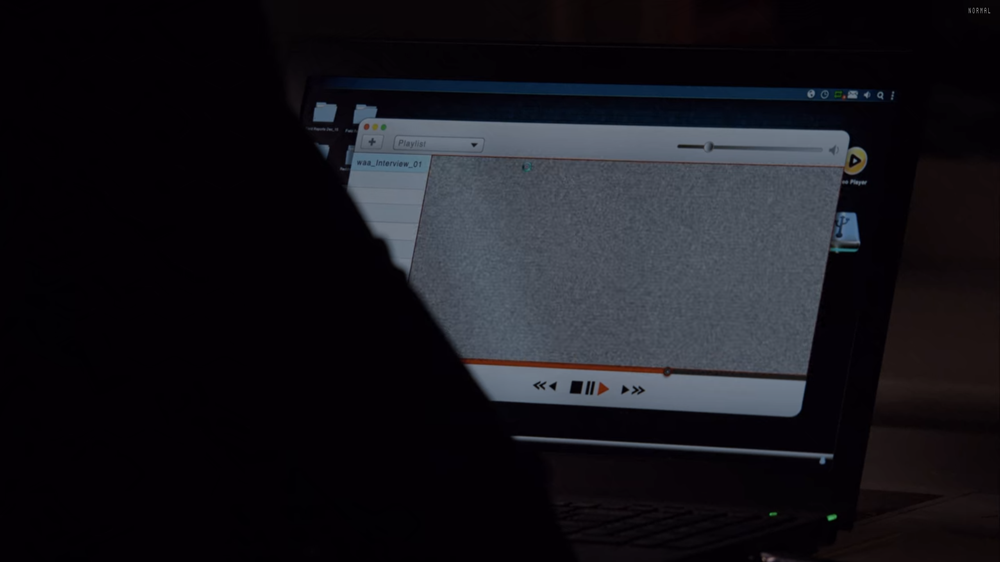

# Random Illusion

_A script to create a random illusion with NumPy and OpenCv_

## Sample Output

## Instructions

You only need numpy and opencv to be installed on your local python environment before running the code.

## Inspiration

I've seen on many tv shows and especially on "The Conway's Game of Life" simulation. May be, I will be create a animation and add here.

Enjoy!